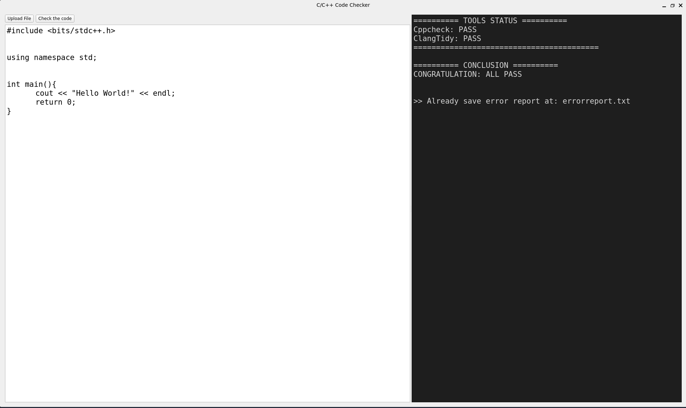

# C/C++ Code Checker GUI 🚀

A modern Qt6-based Graphical User Interface (GUI) tool that integrates `clang-tidy` and `cppcheck` to help you perform static code analysis and find errors in your C/C++ source code easily.

## 🛠 Prerequisites

First, you need to install the required dependencies and tools on your Linux environment (Debian/Ubuntu/Kali) or WSL:

```bash
sudo apt update 
sudo apt install cmake flawfinder clang-tidy cppcheck qt6-base-dev qt6-tools-dev qt6-declarative-dev build-essential -y 
```

## 🚀 How to Build

Second, clone this repository to your local machine:

```bash
git clone https://github.com/khanhlearnin12/codecheckerror.git
cd codecheckerror
```

Third, create a build directory and compile the project:

```bash
mkdir build && cd build 
cmake .. 
make 
```

## 💻 How to Use

After a successful build, you can run the application directly from the terminal:

```bash
./gui

```

*(Optional)* You can also open a specific C++ file directly from the command line:

```bash
./gui path/to/your/code.cpp

```

---

*Hope you guys enjoy my tool! Feel free to open issues or contribute.* ❤️
---
